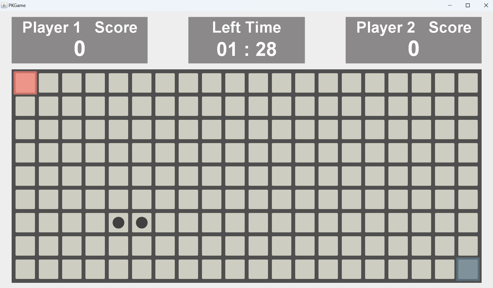

# PKGame

執行方式 :
> windows : .\run.bat
> mac : .\run.sh
 
### 開始畫面
1. 點選預計比的局數
2. Setting 可以調整音量大小以及查看 Github
    

### 選擇關卡方式
1. 選擇自定義關卡或是電腦隨機出題
    

### 選擇關卡
> 按下返回鍵可以重新選擇關卡方式
#### 自定義模式
1. 利用數字鍵選擇想比的關卡
2. 若是三戰兩勝則選擇三關；五戰三勝則選擇五關
3. 按下 "Enter" 開始遊戲
4. 若想要刪除當前的選擇可以按下 "Delete"
#### 隨機關卡模式
1. 按下 "Enter" 開始遊戲

    

## 遊戲說明
### 1A2B

#### 操作：

- 輸入數字 1-9
- 按 "Enter" 確認
- 按 "Delete" 刪除當前數字

#### 規則：

- 輪流猜一個由 1 到 9 的不重複數字組成的四位數
- 如果數字及其位置都正確，則得到 1A
- 如果數字正確但位置錯誤，則得到 1B

#### 獲勝條件：

- 第一個猜出 4A 的玩家獲勝

#### 提醒：
- 隨機由一位玩家開始，當前回合為 "Now Round" 的玩家
- 畫面左右方會記錄玩家所猜的數字以及對應的結果，若猜的次數超過畫面顯示範圍則會清除最舊的輸入

### 2048
#### 操作：

- 玩家1 (左)：使用 WSAD 來控制方塊移動
- 玩家2 (右)：使用箭頭鍵（上、下、左、右）控制方塊移動

#### 規則：

- 當兩個具有相同數字的方塊碰撞時，它們會合併為他們的總和
- 每次移動後，新的方塊（2 或 4）將隨機出現在空白處 ( 2、4 數字出現機率為 3:1 )
- 如果合併出 2048，則遊戲結束
- 如果所有 16 個方塊都被填滿並且無法再移動，則遊戲結束
- 如果時間結束，則遊戲結束 ( 計時 3 分鐘 )

#### 獲勝條件：

- 最先合成出 2048 即可立即贏得遊戲
- 遊戲結束時，得分最高的玩家獲勝

### Snake
#### 操作：

- 玩家1 (左)：使用 WSAD 鍵控制蛇的方向
- 玩家2 (右)：使用箭頭鍵（上、下、左、右）控制蛇的方向

#### 規則：

- 控制蛇的頭部(黑色圓形)，蛇將會往頭選定的方向移動
- 蛇不斷向前移動，並隨著時間的推移而變長
- 吃食物(藍色正方形)可以讓蛇變長得更快
- 如果蛇接觸到自己或任何障礙物，遊戲就會結束
- 當時間耗盡時，遊戲結束

#### 獲勝條件：

- 遊戲結束時得分最高的玩家獲勝

### Whack A Mole
#### 操作：

- 玩家1 (紅色方格)：使用 WSAD 鍵移動，並使用空白鍵進行選擇
- 玩家2 (藍色方格)：使用方向鍵（上、下、左、右）移動，並使用「<」鍵進行選擇

#### 規則：

- 地鼠(深灰色圓形)隨機出現在格子中。使用鍵盤移動到該位置，並按空白鍵（玩家1）或「<」鍵（玩家2）來敲打地鼠
- 如果剩餘時間少於 30 秒，每擊中一顆地鼠就會獲得 +5 分
- 其他時候，每擊中一顆鼴鼠都會獲得 +1 分
- 當時間耗盡時，遊戲結束

#### 獲勝條件：

- 遊戲結束時得分最高的玩家獲勝

### Arrow
#### 操作：

- 玩家1 (左)：使用 WSAD 鍵
- 玩家2 (右)：使用箭頭鍵（上、下、左、右）

#### 規則：

-  按下對應的箭頭鍵以符合螢幕上顯示的方向
-  如果連續正確按下 5 次，將額外獲得 10 分
-  如果連續正確按下 10 次，將獲得額外 5 秒的剩餘時間
-  當時間耗盡時，遊戲結束

#### 獲勝條件：

- 遊戲結束時得分最高的玩家獲勝

### Minesweeper
#### 操作：

- 玩家1 (紅色方格)：使用 WSAD 鍵移動，並使用空白鍵進行選擇
- 玩家2 (藍色方格)：使用方向鍵（上、下、左、右）移動，並使用「<」鍵進行選擇

#### 規則：

-  單擊格子即可顯示數字，該數字表示以該正方形為中心的 3x3 格子中有多少個地雷
-  每位玩家有 15 秒的時間選擇一個方格。如果時間耗盡還尚未，將隨機選擇一個未開啟的格子

#### 獲勝條件：

- 如果玩家揭開所有安全方塊，則獲勝
- 如果玩家點擊了地雷，則輸了

